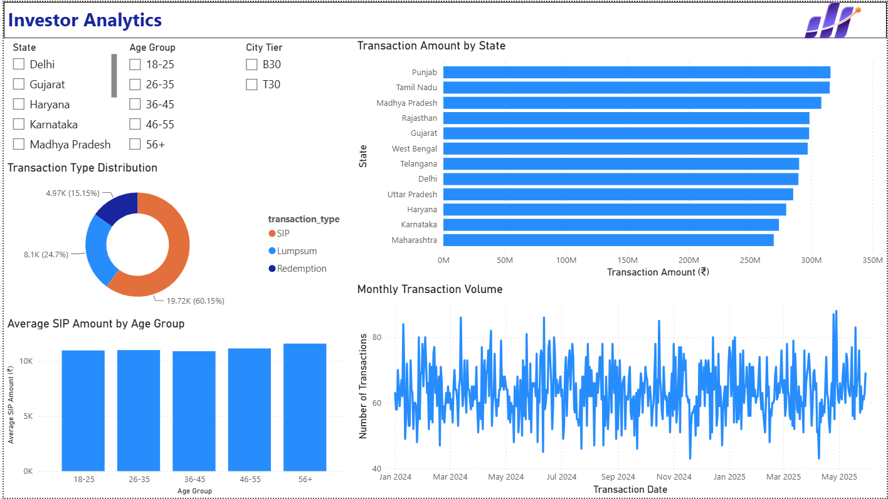

# 📊 Mutual Fund Analytics Platform

An end-to-end Mutual Fund Analytics Platform developed during the **Bluestock FinTech Internship**. The project combines data engineering, financial performance analysis, advanced risk analytics, and interactive business intelligence to transform raw mutual fund data into actionable insights.

---

## 🚀 Project Overview

The platform processes multiple mutual fund datasets through a structured ETL pipeline, performs exploratory and quantitative financial analysis, stores processed data in SQLite, and presents insights using an interactive Power BI dashboard.

The project follows a complete analytics workflow:

```text
Raw Data
    │
    ▼
ETL Pipeline
    │
    ▼
Cleaned Datasets
    │
    ▼
SQLite Database
    │
    ▼
Performance Analytics
    │
    ▼
Advanced Analytics
    │
    ▼
Power BI Dashboard
```

---



# ✨ Features

### Data Engineering

- Automated ETL pipeline
- Data cleaning and preprocessing
- Live NAV fetching using MFAPI
- SQLite database integration
- SQL schema and reusable queries

### Exploratory Data Analysis

- NAV trend analysis
- Industry AUM growth
- Monthly SIP trend
- Investor demographics
- Portfolio sector allocation
- Benchmark comparison
- Correlation analysis

### Performance Analytics

Implemented several financial performance metrics including:

- Daily Returns
- Compound Annual Growth Rate (CAGR)
- Annualized Standard Deviation
- Sharpe Ratio
- Sortino Ratio
- Alpha
- Beta
- Maximum Drawdown
- Tracking Error
- Composite Fund Score

### Advanced Analytics

- Historical Value at Risk (VaR)
- Conditional Value at Risk (CVaR)
- Rolling 90-Day Sharpe Ratio
- Investor Cohort Analysis
- SIP Continuity Analysis
- Portfolio Concentration using HHI
- Rule-based Mutual Fund Recommendation System

### Business Intelligence

Interactive Power BI dashboard featuring:

- Industry Overview
- Fund Performance
- Investor Analytics
- SIP & Market Trends
- Drill-through NAV Detail page
- Interactive slicers and tooltips

---


# 🛠 Technology Stack

| Category | Technologies |
|-----------|--------------|
| Programming | Python |
| Data Analysis | Pandas, NumPy |
| Visualization | Matplotlib |
| Database | SQLite, SQL |
| Business Intelligence | Microsoft Power BI |
| Development | Jupyter Notebook |
| Version Control | Git, GitHub |

---

# 📁 Project Structure

```text
bluestock_mf_capstone/

├── dashboard/
│   ├── bluestock_mf_dashboard.pbix
│   └── Dashboard.pdf
│
├── data/
│   ├── analytics/
│   ├── processed/
│   └── raw/
│
├── notebooks/
│   ├── EDA_Analysis.ipynb
│   ├── Performance_Analytics.ipynb
│   └── Advanced_Analytics.ipynb
│
├── reports/
│   ├── Final_Report.pdf
│   ├── Presentation.pptx
│   └── charts/
│
├── scripts/
│   ├── data_ingestion.py
│   ├── live_nav_fetch.py
│   ├── clean_nav_history.py
│   ├── clean_scheme_performance.py
│   ├── prepare_remaining_cleaned_csvs.py
│   ├── load_sqlite_db.py
│   ├── etl_pipeline.py
│   ├── compute_metrics.py
│   └── recommender.py
│
├── sql/
│   ├── schema.sql
│   └── queries.sql
│
├── README.md
└── requirements.txt
```

---

# ⚙ ETL Pipeline

The ETL pipeline automates data preparation by sequentially executing:

1. Data ingestion
2. Live NAV fetching
3. NAV cleaning
4. Scheme performance cleaning
5. Remaining dataset preparation
6. SQLite database loading

Run the complete pipeline:

```bash
python scripts/etl_pipeline.py
```

---

# 📈 Performance Analytics

The project computes several industry-standard financial metrics including:

| Metric | Purpose |
|----------|---------|
| Daily Returns | Percentage NAV change |
| CAGR | Annualized growth |
| Standard Deviation | Volatility |
| Sharpe Ratio | Risk-adjusted return |
| Sortino Ratio | Downside risk-adjusted return |
| Alpha | Excess benchmark return |
| Beta | Market sensitivity |
| Maximum Drawdown | Largest historical loss |
| Tracking Error | Benchmark deviation |
| Fund Score | Overall ranking metric |

---

# 📊 Dashboard

The Power BI dashboard consists of five interactive pages:

- Industry Overview
- Fund Performance
- Investor Analytics
- SIP & Market Trends
- NAV Detail (Drill-through)

Features include:

- Interactive slicers
- Dynamic filtering
- Tooltips
- Drill-through navigation
- Bluestock themed design

---

# 📌 Key Outcomes

- Built a complete ETL workflow for mutual fund datasets.
- Generated comprehensive financial performance metrics.
- Developed advanced risk analytics and investor behaviour analysis.
- Created a rule-based mutual fund recommendation system.
- Designed an interactive Power BI dashboard for business intelligence.
- Produced a complete technical report and presentation documenting the project.

---

# ▶️ Getting Started

## Clone the repository

```bash
git clone https://github.com/<your-username>/Bluestock_mf_capstone.git
cd Bluestock_mf_capstone
```

## Install dependencies

```bash
pip install -r requirements.txt
```

## Run the ETL pipeline

```bash
python scripts/etl_pipeline.py
```

---

# 📚 Documentation

The repository includes:

- Exploratory Data Analysis notebook
- Performance Analytics notebook
- Advanced Analytics notebook
- SQL schema and queries
- Interactive Power BI dashboard
- Final project report
- Presentation slides

---

# 🔮 Future Improvements

Potential enhancements include:

- Automated ETL scheduling
- Real-time dashboard updates
- Machine learning-based recommendation engine
- Portfolio optimization using Markowitz Efficient Frontier
- Streamlit-based web application
- Monte Carlo simulation for NAV forecasting

---

# 👨‍💻 Author

**Hitesh Tomar**

B.Tech Artificial Intelligence & Machine Learning

Bluestock FinTech Internship – Capstone Project

---


## 📄 License

This project was developed as part of the Bluestock FinTech Internship for educational and evaluation purposes.